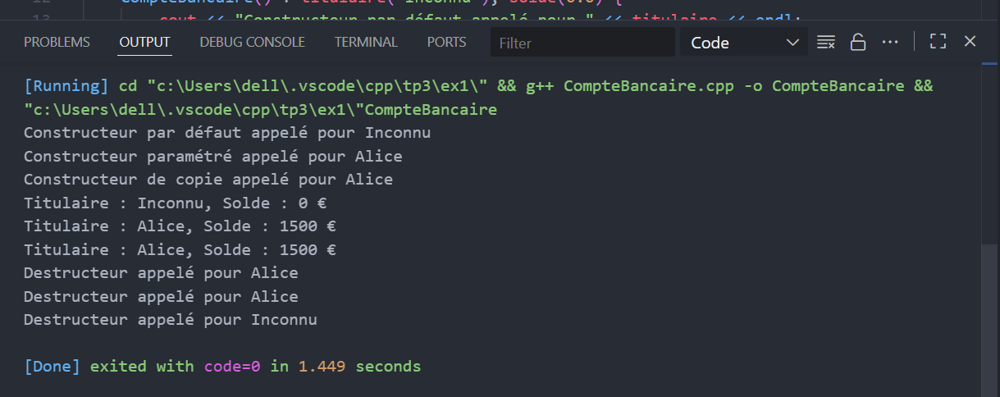
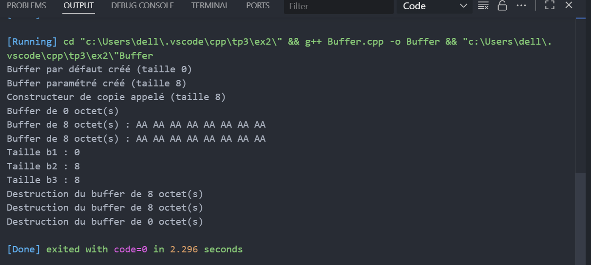

# TP : Programmation Orientée Objet en C++

## Exercice 1 & 2 — Gestion d’un Compte Bancaire et Gestion d’un Buffer Dynamique

---

### Objectif pédagogique  
Ces exercices visent à renforcer la compréhension des **constructeurs**, **destructeurs**, **gestion dynamique de la mémoire**, **règle des trois**, et la **manipulation d’objets** en **C++** à travers deux cas concrets.

---

## Exercice 1 : Gestion d’un Compte Bancaire

### Description  
Cet exercice consiste à créer une classe **CompteBancaire** qui modélise un compte bancaire avec un **titulaire** et un **solde**.  
Le programme met en œuvre différents constructeurs, un destructeur, et une méthode d’affichage.

---

### Fonctionnalités  
- Constructeur par défaut (titulaire = "Inconnu", solde = 0.0).  
- Constructeur paramétré (nom du titulaire et solde initial).  
- Constructeur de copie (copie simple).  
- Méthode `afficher()` pour afficher les informations.  
- Destructeur qui affiche un message lors de la destruction de l’objet.

---

### Résultat  
Constructeur par défaut appelé pour Inconnu  
Constructeur paramétré appelé pour Alice  
Constructeur de copie appelé pour Alice  
Titulaire : Inconnu, Solde : 0 €  
Titulaire : Alice, Solde : 1500 €  
Titulaire : Alice, Solde : 1500 €  
Destructeur appelé pour Alice  
Destructeur appelé pour Alice  
Destructeur appelé pour Inconnu  

---

## Exercice 2 : Gestion d’un Buffer Dynamique

### Description  
Ce programme crée une classe **Buffer** qui encapsule un tableau dynamique d’octets.  
Il met en œuvre la gestion manuelle de la mémoire, la règle des trois, et des méthodes pour manipuler et afficher le buffer.

---

### Fonctionnalités  
- Constructeur par défaut (buffer vide).  
- Constructeur paramétré (allocation dynamique initialisée à zéro).  
- Constructeur de copie (copie profonde).  
- Opérateur d’affectation (copie profonde).  
- Destructeur libérant la mémoire et affichant un message.  
- Méthodes `fill(unsigned char)` et `printHex()`.  
- Méthode `getSize()`.

---

### Résultat  
Buffer par défaut créé (taille 0)  
Buffer paramétré créé (taille 8)  
Constructeur de copie appelé (taille 8)  
Buffer de 0 octet(s)  
Buffer de 8 octet(s) : AA AA AA AA AA AA AA AA   
Buffer de 8 octet(s) : AA AA AA AA AA AA AA AA   
Destruction du buffer de 8 octet(s)  
Destruction du buffer de 8 octet(s)  
Destruction du buffer de 0 octet(s)  

---

